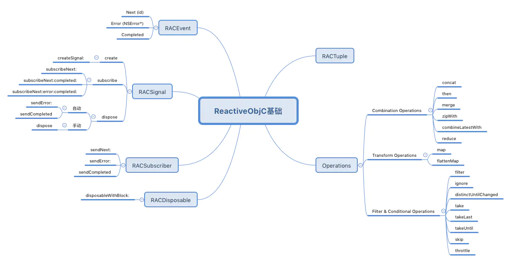

作为一名iOS开发者，你所编写的每一行代码都是针对某些事件的反应，点击按钮、接收到的网络消息、属性改变(通过Key Value Observing)或通过 CoreLocation 改变用户位置都是很好的例子。 然而，这些事件都以不同的方式编码， 作为动作，委托，KVO，回调和其他。 ReactiveCocoa 为事件定义了一个标准接口，因此可以使用一组基本的工具更容易地链接、过滤和组合事件，相比之前的方式更加简单，ReactiveCocoa结合了两种编程风格:  
* 函数式编程，利用高阶函数，即以其他函数为参数的函数;
* 响应式编程，关注数据流和变更传播;

由于这个原因，您可能听说过 ReactiveCocoa 被描述为函数响应式编程(或FRP)框架。  

## 与传统编程对比

传统给按钮添加事件方式如下：
```c
- (void)viewDidLoad {
    [super viewDidLoad];
    // Do any additional setup after loading the view from its nib.
    
    [self.button addTarget:self action:@selector(buttonClick) forControlEvents:UIControlEventTouchUpInside];
}

- (void)buttonClick {
    
}

```
使用RAC 给按钮添加事件方式如下：
```c
- (void)viewDidLoad {
    [super viewDidLoad];
    // Do any additional setup after loading the view from its nib.
    self.button.rac_command = [[RACCommand alloc] initWithSignalBlock:^(id _) {
        NSLog(@"button was pressed!");
        return [RACSignal empty];
    }];
}
```
相比传统方式使用RAC 更加便捷，同理为了监控TextField 文本长度也不需要实现代理方法：
```c
[self.usernameTextField.rac_textSignal subscribeNext:^(id x) {
  NSLog(@"%@", x);
}];
```
## 切入正题 ReactiveObjC
RAC是一个将函数响应式编程范式带入iOS 的开源库，其兼具函数式与响应式的特性。它是由Josh Abernathy和Justin Spahr-Summers当初在
开发GitHub for Mac 过程中创造的，灵感来源于Functional Reactive Programming 。ReactiveCocoa-简称为RAC，现在可分为OC版本-ReactiveObjC和
swift版本-ReactiveSwift。


